# Capas en Archimate e Implementacion de una aplicacion para pedidos en la Tiendecita Los Recuerdos de Ella

A conitnuación se presentan las diferentes vistas elaboradas para la aplicación:

# Comportamiento de Aplicación

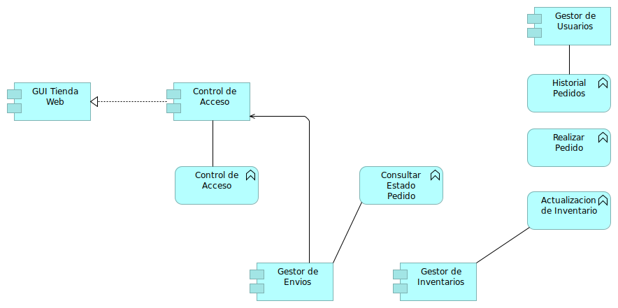

# Contibución de Objetos

# Cooperación de Proceso de Negocio

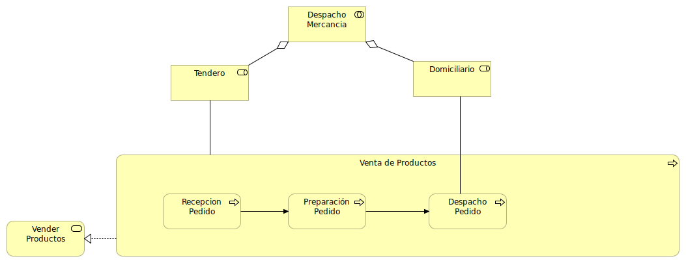

# Estructura de Aplicaciones

# Estructura de Información

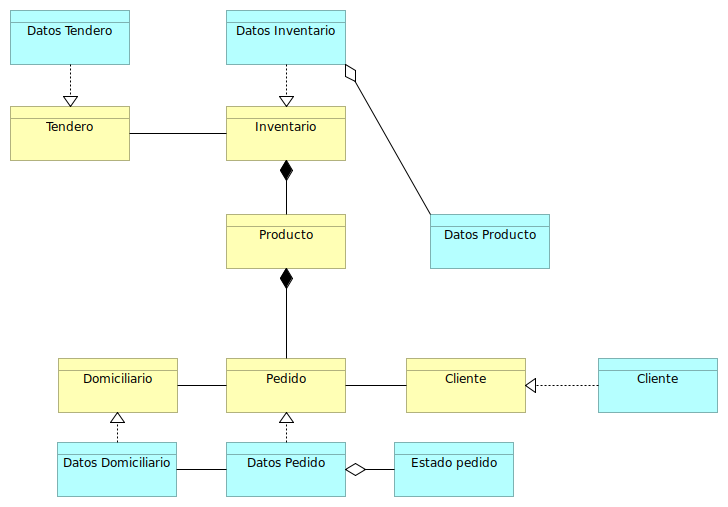

# Funciones del Negocio

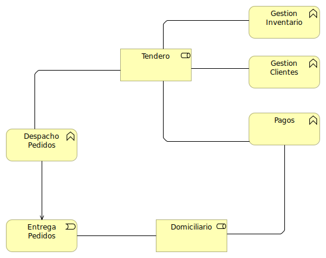

# Infraestructura

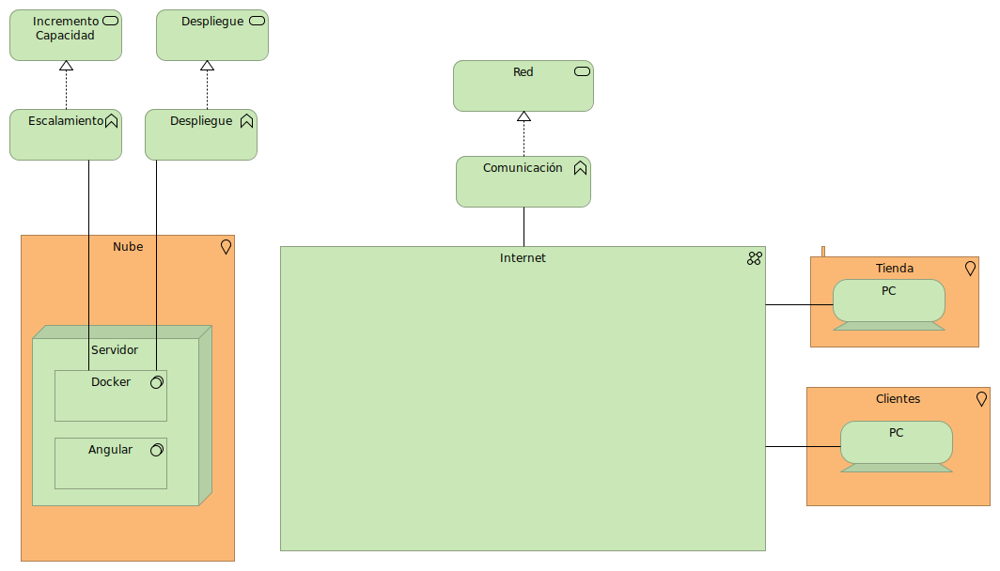

# Motivación

# Procesos de Negocio

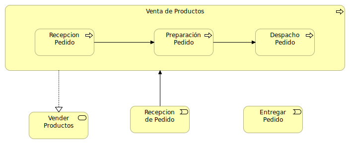

# Producto

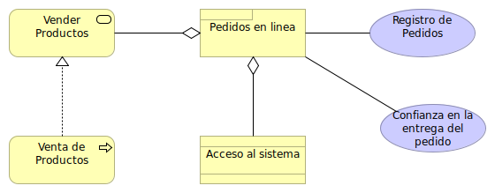

# Realización de Requerimientos

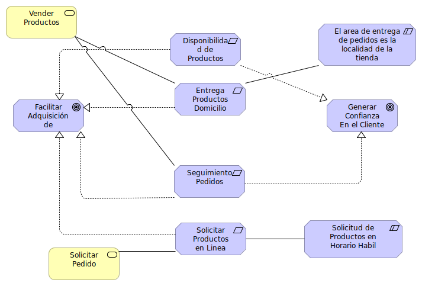

# Realización del Servicio

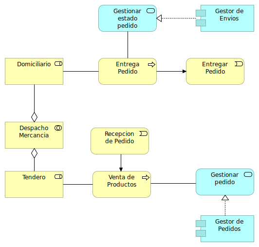

# Resumen por Capas

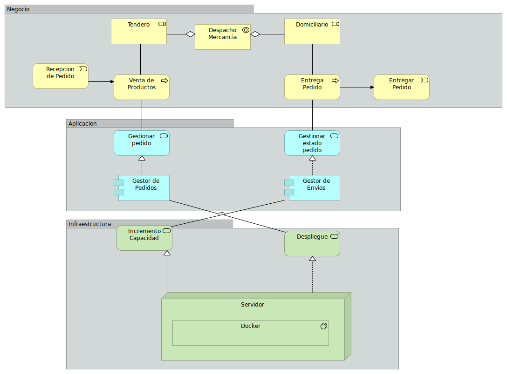

# Uso de Infraestructura

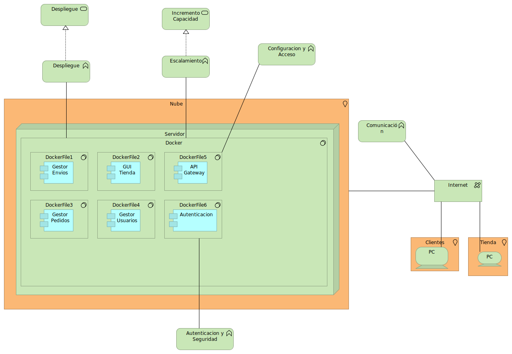

# Uso de Aplicación

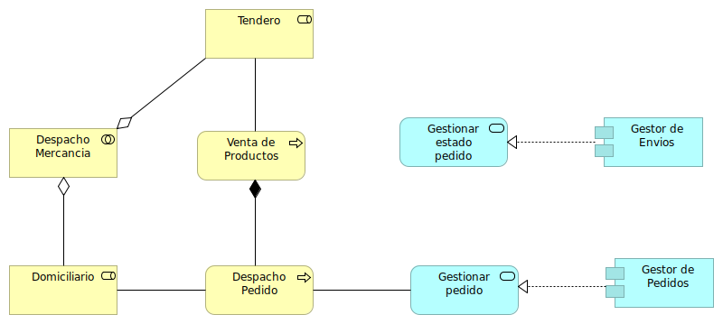

# Vista Modelo Organizacional

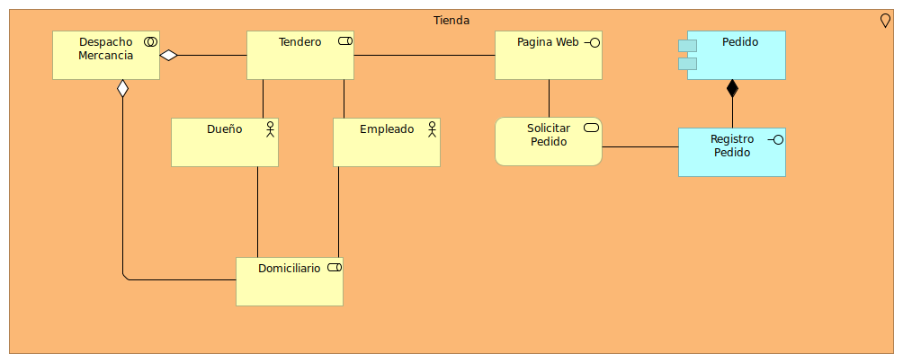
